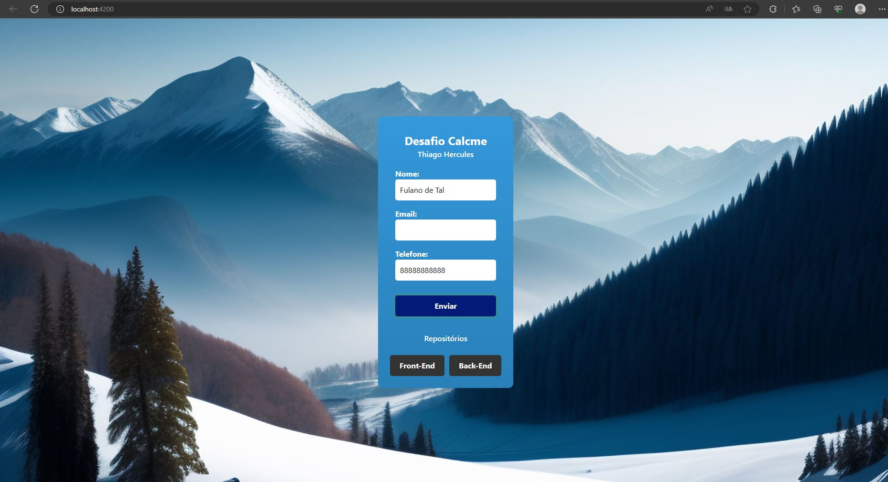
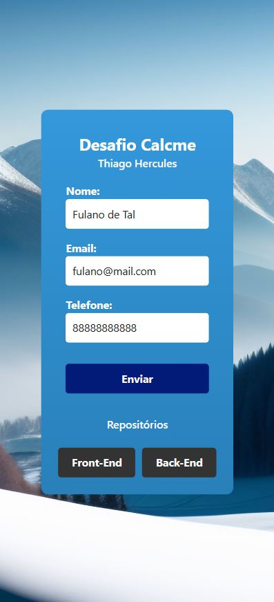

<h1>API RESTful em Spring e MongoDB - Vaga Calcme - Back-end</h1>
<h2> Arquivo de Documentação </h2>

> Api made in springboot to register users in mongodb for the vacancy of calcme

### IDE
- Visual Studio Code
- Spring Tools

### Tecnologias utilizadas
- Java
- Spring 
- MongoDB
- Angular
- TypeScript

### Print da aplicação - Front - No Desktop
  

### Print da aplicação - Front - Responsiva - Smartphone

### Vídeo do projeto compilado e funcionando

## 🚀 Instalando e utilizando a aplicação

1. Instalação do Spring  
Faça o download e instale o Java Development Kit (JDK) versão 11 ou superior.  
Faça o download e instale o Apache Maven. 
Faça o download e instale o Spring Boot CLI.  

2. Importação do Projeto no Spring Tools Suite (STS)  
Faça o download e instale o Spring Tools Suite.  
[Clique aqui para ir ao repositório do back](https://github.com/Thercules/api-spring-mongodb-calcme) 
Abra o STS e clique em File > Import > Existing Maven Projects.  
Navegue até o diretório onde o projeto está localizado e selecione a pasta raiz do projeto.  
Clique em Finish para importar o projeto.   

3. Importação do Projeto no Visual Studio Code (VSCode)  
Faça o download e instale o Visual Studio Code.  
Abra o VSCode e clique em File > Open Folder.  
Navegue até o diretório onde o projeto está localizado e selecione a pasta raiz do projeto.  
[Clique aqui para ir ao repositório do front](https://github.com/Thercules/front-api-spring-mongodb-calcme) 
Clique em Open para importar o projeto.   

4. Atualização das Bibliotecas do Angular  
Abra o terminal no VSCode ou em um terminal separado.  
Navegue até a pasta do projeto onde está localizado o diretório do frontend Angular.  
Execute o seguinte comando para atualizar as dependências:  
`npm install`  
Aguarde até que todas as dependências sejam instaladas.  

5.	Instalação do banco de dados  
Acesse o site oficial do MongoDB e role até a seção de download do MongoDB Compass.  
Selecione o sistema operacional adequado para o seu computador (Windows, macOS ou Linux).  
Clique no botão de download para iniciar o processo de download do MongoDB Compass.  
Após o download, execute o arquivo de instalação.  
Siga as instruções do assistente de instalação para concluir a instalação do MongoDB Compass no seu sistema.  
Após a instalação, abra o MongoDB Compass e você estará pronto para utilizar a ferramenta.   
O arquivo `desafio-calcme.user.json` presente na raiz do repositório contém a collection do banco de dados em formato JSON. Ele está localizado no diretório raiz do projeto.  
[Clique aqui para ir até o arquivo do banco](https://github.com/Thercules/api-spring-mongodb-calcme/blob/master/desafio-calcme.user.json)

### 📫 Deseja contribuir para o projeto?
Para contribuir com o projeto, siga estas etapas:

1. Bifurque este repositório.
2. Crie um branch: `git checkout -b <nome_branch>`.
3. Faça suas alterações e confirme-as: `git commit -m '<mensagem_commit>'`
4. Envie para o branch original: `git push origin <API_NODEJS_JWT_MONGODB_> / <local>`
5. Crie a solicitação de pull.

Como alternativa, consulte a documentação do GitHub em [como criar uma solicitação pull](https://help.github.com/en/github/collaborating-with-issues-and-pull-requests/creating-a-pull-request).

### 📝 Licença

Esse projeto está sob licença. Veja o arquivo [LICENÇA](LICENSE.md) para mais detalhes.

[⬆ Voltar ao topo](#api-spring-mongodb-calcme) 

